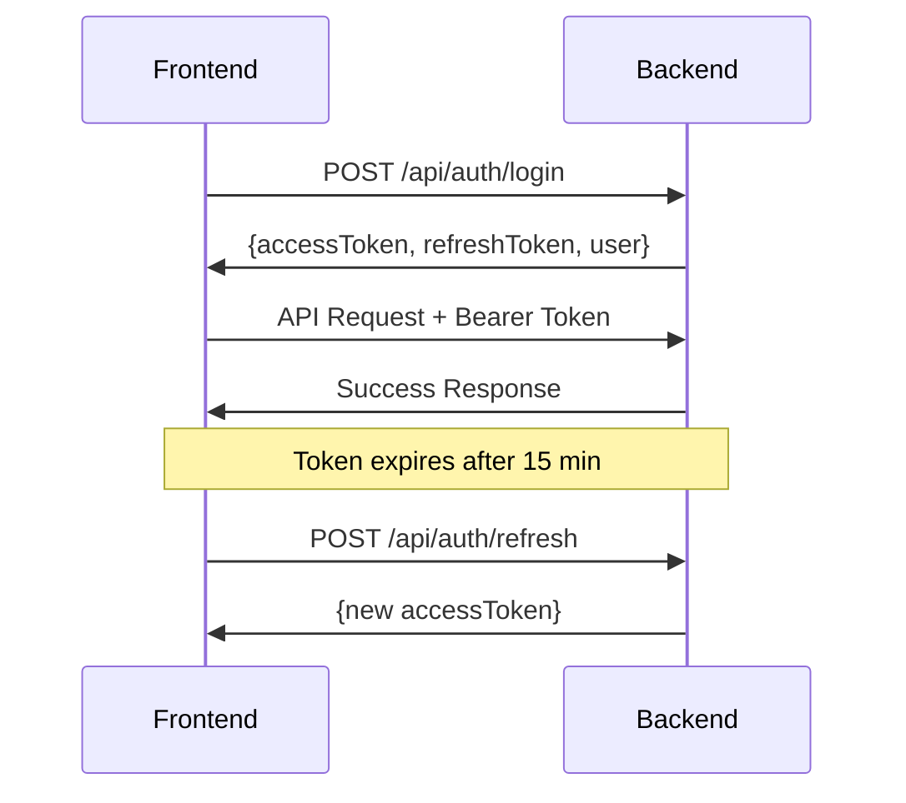

# 🔌 API Documentation

**Montana DPHHS Healthcare Coordination Platform - Spring Boot Backend Specification**

Last Updated: November 28, 2025

---

## 📋 Table of Contents

1. [Overview](#overview)
2. [Base URL & Configuration](#base-url--configuration)
3. [Authentication](#authentication)
4. [Error Handling](#error-handling)
5. [API Endpoints](#api-endpoints)
   - [Authentication Endpoints](#authentication-endpoints)
   - [Provider Endpoints](#provider-endpoints)
   - [Patient Endpoints](#patient-endpoints)
   - [Claims Endpoints](#claims-endpoints)
   - [State Agent Endpoints](#state-agent-endpoints)
   - [CAQH Integration Endpoints](#caqh-integration-endpoints)
6. [Data Models (DTOs)](#data-models-dtos)
7. [Status Codes](#status-codes)
8. [Rate Limiting](#rate-limiting)
9. [HIPAA Compliance](#hipaa-compliance)

---

## 📖 Overview

This document specifies the REST API endpoints that the Spring Boot backend must implement to support the React frontend application.

### **API Principles**
- RESTful architecture
- JSON request/response format
- JWT-based authentication
- HIPAA-compliant audit logging
- Comprehensive error handling
- Role-based access control (RBAC)

### **Base Technologies**
- **Framework**: Spring Boot 3.x
- **Security**: Spring Security 6.x with JWT
- **Database**: PostgreSQL 15+
- **ORM**: Spring Data JPA
- **Documentation**: Swagger/OpenAPI 3.0

---

## 🌐 Base URL & Configuration

### **Environment URLs**

```
Development:  http://localhost:8080/api
Staging:      https://staging-api.montana-dphhs.gov/api
Production:   https://api.montana-dphhs.gov/api
```

### **API Versioning**
- **Current Version**: v1
- **Base Path**: `/api/v1` (optional, can use `/api` for initial version)

### **Headers**

#### Required Headers
```http
Content-Type: application/json
Authorization: Bearer {jwt_token}
```

#### Optional Headers
```http
X-Request-ID: {unique_request_id}
X-Correlation-ID: {correlation_id}
Accept-Language: en-US
```

---

## 🔐 Authentication

### **JWT Token Structure**

#### Access Token (Short-lived: 15 minutes)
```json
{
  "sub": "user_id",
  "email": "user@example.com",
  "role": "PROVIDER | STATE_AGENT",
  "firstName": "John",
  "lastName": "Doe",
  "organizationId": "org_123",
  "permissions": ["READ_PATIENTS", "WRITE_CLAIMS"],
  "iat": 1701234567,
  "exp": 1701235467
}
```

#### Refresh Token (Long-lived: 7 days)
```json
{
  "sub": "user_id",
  "type": "refresh",
  "iat": 1701234567,
  "exp": 1701839367
}
```

### **Authentication Flow**



---

## 🚨 Error Handling

### **Standard Error Response**

```json
{
  "timestamp": "2025-11-28T12:34:56.789Z",
  "status": 400,
  "error": "Bad Request",
  "message": "Invalid patient data",
  "errors": [
    {
      "field": "dateOfBirth",
      "message": "Date of birth is required"
    }
  ],
  "path": "/api/patients",
  "requestId": "req_abc123"
}
```

### **Common HTTP Status Codes**

| Code | Meaning | Usage |
|------|---------|-------|
| 200 | OK | Successful GET, PUT |
| 201 | Created | Successful POST |
| 204 | No Content | Successful DELETE |
| 400 | Bad Request | Invalid input data |
| 401 | Unauthorized | Missing/invalid token |
| 403 | Forbidden | Insufficient permissions |
| 404 | Not Found | Resource doesn't exist |
| 409 | Conflict | Duplicate resource |
| 422 | Unprocessable Entity | Validation failed |
| 429 | Too Many Requests | Rate limit exceeded |
| 500 | Internal Server Error | Server error |
| 503 | Service Unavailable | Maintenance mode |

---

## 🔌 API Endpoints

## Authentication Endpoints

### **POST /api/auth/login**

Authenticate user and return JWT tokens.

**Request:**
```json
{
  "email": "provider@example.com",
  "password": "SecurePassword123!",
  "role": "PROVIDER"
}
```

**Response: 200 OK**
```json
{
  "accessToken": "eyJhbGciOiJIUzI1NiIsInR5cCI6IkpXVCJ9...",
  "refreshToken": "eyJhbGciOiJIUzI1NiIsInR5cCI6IkpXVCJ9...",
  "expiresIn": 900,
  "user": {
    "id": "user_123",
    "email": "provider@example.com",
    "role": "PROVIDER",
    "firstName": "John",
    "lastName": "Doe",
    "organization": "ABC Medical Center",
    "caqhConnected": true
  }
}
```

**Error Response: 401 Unauthorized**
```json
{
  "timestamp": "2025-11-28T12:34:56Z",
  "status": 401,
  "error": "Unauthorized",
  "message": "Invalid email or password"
}
```

---

### **POST /api/auth/register**

Register a new provider or state agent.

**Request:**
```json
{
  "email": "newprovider@example.com",
  "password": "SecurePassword123!",
  "firstName": "Jane",
  "lastName": "Smith",
  "role": "PROVIDER",
  "providerType": "INDIVIDUAL",
  "npi": "1234567890",
  "specialty": "Family Medicine",
  "licenseNumber": "MD-12345",
  "organizationName": "Smith Family Practice",
  "invitationCode": null
}
```

**Response: 201 Created**
```json
{
  "id": "user_124",
  "email": "newprovider@example.com",
  "firstName": "Jane",
  "lastName": "Smith",
  "role": "PROVIDER",
  "status": "PENDING_VERIFICATION",
  "caqhConnected": false,
  "createdAt": "2025-11-28T12:34:56Z"
}
```

---

### **POST /api/auth/refresh**

Refresh access token using refresh token.

**Request:**
```json
{
  "refreshToken": "eyJhbGciOiJIUzI1NiIsInR5cCI6IkpXVCJ9..."
}
```

**Response: 200 OK**
```json
{
  "accessToken": "eyJhbGciOiJIUzI1NiIsInR5cCI6IkpXVCJ9...",
  "expiresIn": 900
}
```

---

### **POST /api/auth/logout**

Invalidate refresh token.

**Request Headers:**
```
Authorization: Bearer {access_token}
```

**Response: 204 No Content**

---

## Provider Endpoints

### **GET /api/providers**

Get list of all providers (State Agent only).

**Query Parameters:**
- `page` (int): Page number (default: 0)
- `size` (int): Page size (default: 20)
- `sort` (string): Sort field (default: "createdAt,desc")
- `status` (string): Filter by status (ACTIVE, PENDING, SUSPENDED)

**Response: 200 OK**
```json
{
  "content": [
    {
      "id": "provider_123",
      "firstName": "John",
      "lastName": "Doe",
      "name": "Dr. John Doe",
      "email": "john.doe@example.com",
      "npi": "1234567890",
      "specialty": "Family Medicine",
      "licenseNumber": "MD-12345",
      "providerType": "INDIVIDUAL",
      "status": "ACTIVE",
      "caqhConnected": true,
      "caqhStatus": "VERIFIED",
      "organizationName": "ABC Medical Center",
      "createdAt": "2025-01-15T10:00:00Z",
      "lastModified": "2025-11-20T14:30:00Z"
    }
  ],
  "pageable": {
    "pageNumber": 0,
    "pageSize": 20,
    "totalPages": 5,
    "totalElements": 95
  }
}
```

---

### **POST /api/providers/enroll**

Submit provider enrollment application.

**Request:**
```json
{
  "firstName": "John",
  "lastName": "Doe",
  "email": "john.doe@example.com",
  "phone": "(406) 555-1234",
  "npi": "1234567890",
  "specialty": "Family Medicine",
  "licenseNumber": "MD-12345",
  "licenseState": "MT",
  "licenseExpiry": "2026-12-31",
  "providerType": "INDIVIDUAL",
  "taxonomyCode": "207Q00000X",
  "address": {
    "street": "123 Main St",
    "city": "Helena",
    "state": "MT",
    "zipCode": "59601"
  },
  "caqhProviderId": "12345678"
}
```

**Response: 201 Created**
```json
{
  "id": "provider_124",
  "status": "PENDING_REVIEW",
  "enrollmentId": "ENR-2025-001234",
  "submittedAt": "2025-11-28T12:34:56Z",
  "message": "Enrollment application submitted successfully"
}
```

---

### **GET /api/providers/{id}/credentials**

Get provider credentialing status.

**Response: 200 OK**
```json
{
  "providerId": "provider_123",
  "caqhConnected": true,
  "caqhProviderId": "12345678",
  "caqhStatus": "VERIFIED",
  "lastVerified": "2025-11-15T09:00:00Z",
  "credentials": {
    "npi": {
      "value": "1234567890",
      "status": "VERIFIED",
      "verifiedAt": "2025-11-15T09:00:00Z"
    },
    "license": {
      "number": "MD-12345",
      "state": "MT",
      "status": "ACTIVE",
      "expiryDate": "2026-12-31",
      "verifiedAt": "2025-11-15T09:00:00Z"
    },
    "deaRegistration": {
      "number": "AD1234567",
      "status": "ACTIVE",
      "expiryDate": "2026-06-30",
      "verifiedAt": "2025-11-15T09:00:00Z"
    }
  }
}
```

---

### **POST /api/providers/delegate-invite**

Send invitation to delegate.

**Request:**
```json
{
  "email": "delegate@example.com",
  "firstName": "Jane",
  "lastName": "Smith",
  "role": "CARE_COORDINATOR",
  "permissions": ["READ_PATIENTS", "WRITE_NOTES"]
}
```

**Response: 201 Created**
```json
{
  "invitationId": "inv_abc123",
  "invitationCode": "DELEGATE-2025-ABC123",
  "email": "delegate@example.com",
  "expiresAt": "2025-12-05T12:34:56Z",
  "status": "SENT"
}
```

---

## Patient Endpoints

### **GET /api/patients**

Get list of patients for the authenticated provider.

**Query Parameters:**
- `page` (int): Page number
- `size` (int): Page size
- `search` (string): Search by name or ID
- `status` (string): Filter by status

**Response: 200 OK**
```json
{
  "content": [
    {
      "id": "patient_001",
      "firstName": "Sarah",
      "lastName": "Johnson",
      "dateOfBirth": "1985-03-15",
      "medicaidId": "MT-12345678",
      "status": "Active",
      "lastVisit": "2025-11-15",
      "assignedProvider": "Dr. John Doe",
      "phone": "(406) 555-9876",
      "email": "sarah.j@example.com",
      "enrollmentDate": "2024-01-10"
    }
  ],
  "pageable": {
    "pageNumber": 0,
    "pageSize": 20,
    "totalPages": 3,
    "totalElements": 52
  }
}
```

---

### **POST /api/patients**

Enroll a new patient.

**Request:**
```json
{
  "firstName": "Sarah",
  "lastName": "Johnson",
  "dateOfBirth": "1985-03-15",
  "gender": "F",
  "medicaidId": "MT-12345678",
  "ssn": "123-45-6789",
  "phone": "(406) 555-9876",
  "email": "sarah.j@example.com",
  "address": {
    "street": "456 Oak Ave",
    "city": "Billings",
    "state": "MT",
    "zipCode": "59101"
  },
  "insurance": {
    "primary": {
      "provider": "Montana Medicaid",
      "memberId": "MT-12345678",
      "groupNumber": "GRP-001"
    }
  },
  "emergencyContact": {
    "name": "John Johnson",
    "relationship": "Spouse",
    "phone": "(406) 555-9877"
  }
}
```

**Response: 201 Created**
```json
{
  "id": "patient_053",
  "enrollmentId": "PAT-2025-001235",
  "status": "Active",
  "enrollmentDate": "2025-11-28",
  "message": "Patient enrolled successfully"
}
```

---

### **GET /api/patients/{id}**

Get detailed patient information.

**Response: 200 OK**
```json
{
  "id": "patient_001",
  "firstName": "Sarah",
  "lastName": "Johnson",
  "dateOfBirth": "1985-03-15",
  "age": 40,
  "gender": "F",
  "medicaidId": "MT-12345678",
  "status": "Active",
  "assignedProvider": "Dr. John Doe",
  "enrollmentDate": "2024-01-10",
  "contact": {
    "phone": "(406) 555-9876",
    "email": "sarah.j@example.com",
    "address": {
      "street": "456 Oak Ave",
      "city": "Billings",
      "state": "MT",
      "zipCode": "59101"
    }
  },
  "insurance": {
    "primary": {
      "provider": "Montana Medicaid",
      "memberId": "MT-12345678",
      "status": "ACTIVE"
    }
  },
  "visits": [
    {
      "id": "visit_001",
      "date": "2025-11-15",
      "type": "Follow-up",
      "provider": "Dr. John Doe",
      "diagnosis": ["Z00.00 - General health checkup"],
      "procedures": ["99213 - Office visit"],
      "notes": "Patient doing well, no concerns"
    }
  ],
  "activeConditions": [
    "Hypertension",
    "Type 2 Diabetes"
  ],
  "medications": [
    {
      "name": "Lisinopril 10mg",
      "frequency": "Once daily",
      "prescribedDate": "2024-03-15"
    }
  ]
}
```

---

### **PUT /api/patients/{id}**

Update patient information.

**Request:**
```json
{
  "phone": "(406) 555-1111",
  "email": "newemail@example.com",
  "address": {
    "street": "789 New St",
    "city": "Helena",
    "state": "MT",
    "zipCode": "59601"
  }
}
```

**Response: 200 OK**
```json
{
  "id": "patient_001",
  "message": "Patient information updated successfully",
  "lastModified": "2025-11-28T12:34:56Z"
}
```

---

### **DELETE /api/patients/{id}**

Soft delete a patient (mark as inactive).

**Response: 204 No Content**

---

## Claims Endpoints

### **GET /api/claims**

Get list of claims for authenticated provider.

**Query Parameters:**
- `page`, `size`, `sort`
- `status`: Filter by claim status
- `fromDate`: Start date (YYYY-MM-DD)
- `toDate`: End date (YYYY-MM-DD)
- `patientId`: Filter by patient

**Response: 200 OK**
```json
{
  "content": [
    {
      "id": "claim_001",
      "claimNumber": "CLM-2025-001234",
      "patientId": "patient_001",
      "patientName": "Sarah Johnson",
      "provider": "Dr. John Doe",
      "status": "Submitted to Insurance",
      "dateCreated": "2025-11-20",
      "dateSubmitted": "2025-11-21",
      "totalAmount": 325.00,
      "diagnosisCodes": ["Z00.00"],
      "procedureCodes": ["99213"],
      "serviceDate": "2025-11-15"
    }
  ],
  "pageable": {
    "pageNumber": 0,
    "pageSize": 20,
    "totalPages": 2,
    "totalElements": 35
  }
}
```

---

### **POST /api/claims**

Create a new claim.

**Request:**
```json
{
  "patientId": "patient_001",
  "serviceDate": "2025-11-15",
  "diagnosisCodes": ["Z00.00", "I10"],
  "procedureCodes": [
    {
      "code": "99213",
      "description": "Office visit",
      "amount": 125.00
    },
    {
      "code": "80053",
      "description": "Comprehensive metabolic panel",
      "amount": 200.00
    }
  ],
  "totalAmount": 325.00,
  "notes": "Routine follow-up visit",
  "attachments": ["doc_001", "doc_002"]
}
```

**Response: 201 Created**
```json
{
  "id": "claim_036",
  "claimNumber": "CLM-2025-001236",
  "status": "Draft",
  "createdAt": "2025-11-28T12:34:56Z",
  "message": "Claim created successfully"
}
```

---

### **GET /api/claims/{id}**

Get detailed claim information.

**Response: 200 OK**
```json
{
  "id": "claim_001",
  "claimNumber": "CLM-2025-001234",
  "patient": {
    "id": "patient_001",
    "name": "Sarah Johnson",
    "medicaidId": "MT-12345678"
  },
  "provider": {
    "id": "provider_123",
    "name": "Dr. John Doe",
    "npi": "1234567890"
  },
  "serviceDate": "2025-11-15",
  "status": "Submitted to Insurance",
  "statusHistory": [
    {
      "status": "Draft",
      "timestamp": "2025-11-20T10:00:00Z",
      "user": "Dr. John Doe"
    },
    {
      "status": "Awaiting Member Review",
      "timestamp": "2025-11-20T11:00:00Z",
      "user": "Dr. John Doe"
    },
    {
      "status": "Submitted to Insurance",
      "timestamp": "2025-11-21T09:00:00Z",
      "user": "Agent Smith"
    }
  ],
  "diagnosisCodes": [
    {
      "code": "Z00.00",
      "description": "General health checkup"
    }
  ],
  "procedureCodes": [
    {
      "code": "99213",
      "description": "Office visit",
      "amount": 125.00,
      "approved": true
    }
  ],
  "totalAmount": 325.00,
  "approvedAmount": 325.00,
  "attachments": [
    {
      "id": "doc_001",
      "filename": "visit_notes.pdf",
      "uploadedAt": "2025-11-20T10:15:00Z"
    }
  ],
  "notes": "Routine follow-up visit"
}
```

---

### **PUT /api/claims/{id}**

Update claim information (only in Draft status).

**Request:**
```json
{
  "diagnosisCodes": ["Z00.00", "I10", "E11.9"],
  "notes": "Updated notes"
}
```

**Response: 200 OK**
```json
{
  "id": "claim_001",
  "message": "Claim updated successfully",
  "lastModified": "2025-11-28T12:34:56Z"
}
```

---

### **POST /api/claims/{id}/submit**

Submit claim for review.

**Response: 200 OK**
```json
{
  "id": "claim_001",
  "status": "Awaiting Member Review",
  "submittedAt": "2025-11-28T12:34:56Z",
  "message": "Claim submitted for review"
}
```

---

## State Agent Endpoints

### **GET /api/state-agent/enrollments**

Get provider enrollment applications for review.

**Query Parameters:**
- `page`, `size`, `sort`
- `status`: PENDING, APPROVED, DENIED

**Response: 200 OK**
```json
{
  "content": [
    {
      "id": "enrollment_001",
      "enrollmentId": "ENR-2025-001234",
      "provider": {
        "firstName": "John",
        "lastName": "Doe",
        "email": "john.doe@example.com",
        "npi": "1234567890",
        "specialty": "Family Medicine"
      },
      "status": "PENDING_REVIEW",
      "submittedAt": "2025-11-25T10:00:00Z",
      "caqhStatus": "VERIFIED"
    }
  ],
  "pageable": {
    "pageNumber": 0,
    "pageSize": 20,
    "totalPages": 1,
    "totalElements": 15
  }
}
```

---

### **PUT /api/state-agent/enrollments/{id}/approve**

Approve provider enrollment.

**Request:**
```json
{
  "notes": "All credentials verified. Approved for Montana Medicaid.",
  "effectiveDate": "2025-12-01"
}
```

**Response: 200 OK**
```json
{
  "id": "enrollment_001",
  "status": "APPROVED",
  "approvedBy": "Agent Smith",
  "approvedAt": "2025-11-28T12:34:56Z",
  "effectiveDate": "2025-12-01"
}
```

---

### **PUT /api/state-agent/enrollments/{id}/deny**

Deny provider enrollment.

**Request:**
```json
{
  "reason": "Incomplete CAQH verification",
  "notes": "Please update CAQH profile and resubmit"
}
```

**Response: 200 OK**
```json
{
  "id": "enrollment_001",
  "status": "DENIED",
  "deniedBy": "Agent Smith",
  "deniedAt": "2025-11-28T12:34:56Z",
  "reason": "Incomplete CAQH verification"
}
```

---

### **GET /api/state-agent/claims**

Get all claims for review (State Agent view).

**Query Parameters:**
- `page`, `size`, `sort`
- `status`: Filter by claim status
- `providerId`: Filter by provider

**Response: 200 OK**
```json
{
  "content": [
    {
      "id": "claim_001",
      "claimNumber": "CLM-2025-001234",
      "patient": "Sarah Johnson",
      "provider": "Dr. John Doe",
      "status": "In Progress",
      "totalAmount": 325.00,
      "submittedDate": "2025-11-20",
      "assignedTo": "Agent Smith"
    }
  ],
  "pageable": {
    "pageNumber": 0,
    "pageSize": 50,
    "totalPages": 5,
    "totalElements": 235
  }
}
```

---

### **PUT /api/state-agent/claims/{id}/process**

Process claim (State Agent workflow).

**Request:**
```json
{
  "action": "APPROVE",
  "approvedAmount": 325.00,
  "notes": "All documentation verified. Approved for payment.",
  "processDate": "2025-11-28"
}
```

**Response: 200 OK**
```json
{
  "id": "claim_001",
  "status": "Approved",
  "processedBy": "Agent Smith",
  "processedAt": "2025-11-28T12:34:56Z",
  "approvedAmount": 325.00
}
```

---

## CAQH Integration Endpoints

### **POST /api/caqh/verify**

Verify provider credentials via CAQH ProView®.

**Request:**
```json
{
  "providerId": "provider_123",
  "caqhProviderId": "12345678"
}
```

**Response: 200 OK**
```json
{
  "providerId": "provider_123",
  "caqhProviderId": "12345678",
  "status": "VERIFIED",
  "verifiedAt": "2025-11-28T12:34:56Z",
  "credentials": {
    "npi": "1234567890",
    "licenseNumber": "MD-12345",
    "licenseState": "MT",
    "licenseStatus": "ACTIVE",
    "deaRegistration": "AD1234567"
  },
  "attestationDate": "2025-11-15",
  "reAttestationDue": "2026-05-15"
}
```

---

### **GET /api/caqh/status/{providerId}**

Get current CAQH verification status.

**Response: 200 OK**
```json
{
  "providerId": "provider_123",
  "caqhProviderId": "12345678",
  "status": "VERIFIED",
  "lastVerified": "2025-11-15T09:00:00Z",
  "nextVerificationDue": "2026-05-15",
  "attestationStatus": "CURRENT",
  "credentialingStatus": "COMPLETE"
}
```

---

### **POST /api/caqh/refresh**

Force refresh of CAQH data.

**Request:**
```json
{
  "providerId": "provider_123"
}
```

**Response: 202 Accepted**
```json
{
  "message": "CAQH verification refresh initiated",
  "jobId": "job_abc123",
  "estimatedCompletion": "2025-11-28T12:40:00Z"
}
```

---

## 📊 Data Models (DTOs)

### User DTO
```java
public class UserDTO {
    private String id;
    private String email;
    private String role; // PROVIDER, STATE_AGENT
    private String firstName;
    private String lastName;
    private String organization;
    private Boolean caqhConnected;
    private LocalDateTime createdAt;
    private LocalDateTime lastLoginAt;
}
```

### Patient DTO
```java
public class PatientDTO {
    private String id;
    private String firstName;
    private String lastName;
    private LocalDate dateOfBirth;
    private String gender;
    private String medicaidId;
    private String status;
    private String phone;
    private String email;
    private AddressDTO address;
    private InsuranceDTO insurance;
    private String assignedProvider;
    private LocalDate enrollmentDate;
    private LocalDate lastVisit;
}
```

### Claim DTO
```java
public class ClaimDTO {
    private String id;
    private String claimNumber;
    private String patientId;
    private String patientName;
    private String providerId;
    private String provider;
    private ClaimStatus status;
    private LocalDate serviceDate;
    private LocalDateTime dateCreated;
    private LocalDateTime dateSubmitted;
    private BigDecimal totalAmount;
    private BigDecimal approvedAmount;
    private List<String> diagnosisCodes;
    private List<ProcedureCodeDTO> procedureCodes;
    private String notes;
    private List<AttachmentDTO> attachments;
}
```

### Provider DTO
```java
public class ProviderDTO {
    private String id;
    private String firstName;
    private String lastName;
    private String name;
    private String email;
    private String npi;
    private String specialty;
    private String licenseNumber;
    private String licenseState;
    private LocalDate licenseExpiry;
    private String providerType; // INDIVIDUAL, ORGANIZATION
    private String status;
    private Boolean caqhConnected;
    private String caqhStatus;
    private String organizationName;
    private AddressDTO address;
    private LocalDateTime createdAt;
}
```

---

## 🔒 HIPAA Compliance

### Audit Logging

All API requests that access or modify PHI must be logged:

```json
{
  "timestamp": "2025-11-28T12:34:56.789Z",
  "userId": "user_123",
  "userName": "John Doe",
  "action": "READ_PATIENT",
  "resourceType": "Patient",
  "resourceId": "patient_001",
  "ipAddress": "192.168.1.100",
  "userAgent": "Mozilla/5.0...",
  "requestId": "req_abc123",
  "result": "SUCCESS"
}
```

### Data Encryption

- **In Transit**: TLS 1.3
- **At Rest**: AES-256 encryption for PHI fields
- **Database**: PostgreSQL with encrypted fields

### Access Control

Role-based permissions enforced at API level:

| Role | Permissions |
|------|-------------|
| PROVIDER | Read/Write own patients, claims |
| STATE_AGENT | Read all, Approve enrollments, Process claims |
| DELEGATE | Limited access per invitation |

---

## ⚡ Rate Limiting

### Limits

| Endpoint Type | Rate Limit |
|---------------|------------|
| Authentication | 5 requests / minute |
| Read Operations | 100 requests / minute |
| Write Operations | 50 requests / minute |
| CAQH Integration | 10 requests / minute |

### Rate Limit Headers

```http
X-RateLimit-Limit: 100
X-RateLimit-Remaining: 85
X-RateLimit-Reset: 1701235200
```

---

## 📝 Implementation Notes

### Required Spring Boot Dependencies

```xml
<dependencies>
    <dependency>
        <groupId>org.springframework.boot</groupId>
        <artifactId>spring-boot-starter-web</artifactId>
    </dependency>
    <dependency>
        <groupId>org.springframework.boot</groupId>
        <artifactId>spring-boot-starter-security</artifactId>
    </dependency>
    <dependency>
        <groupId>org.springframework.boot</groupId>
        <artifactId>spring-boot-starter-data-jpa</artifactId>
    </dependency>
    <dependency>
        <groupId>org.postgresql</groupId>
        <artifactId>postgresql</artifactId>
    </dependency>
    <dependency>
        <groupId>io.jsonwebtoken</groupId>
        <artifactId>jjwt-api</artifactId>
        <version>0.12.3</version>
    </dependency>
</dependencies>
```

### Swagger/OpenAPI Configuration

Add Swagger for API documentation:
```xml
<dependency>
    <groupId>org.springdoc</groupId>
    <artifactId>springdoc-openapi-starter-webmvc-ui</artifactId>
    <version>2.3.0</version>
</dependency>
```

Access at: `http://localhost:8080/swagger-ui.html`

---

**API Documentation Owner**: Backend Development Team  
**Last Updated**: November 28, 2025  
**Version**: 1.0.0
